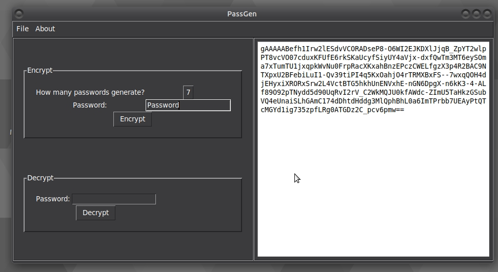

#  PassGen

A tool used to generate and menage passwords. It allows to generate up to 10 passwords, encrypt them and saved to a password-protected *.pgen file. Using the same program *.pgen file can be opened and decrypted using provided password.

## Motivation

The aim of this project was to help menage passwords and keep them in the ecrypted form for safety reasons. Many users have to change passwords on a regular basis (like every 3 months). It is way much easier to create a list of passwords, divide them in 1-10 categories and then use this tool to generate/store passwords for such a list.

## Installation

Standalone executables are available and tested for Windows 10 and Linux(Ubuntu 18.04) systems. Please download the right version of the program using [Windows](https://github.com/piotrpatrzylas/PassGen/blob/master/Windows/PassGen.exe) or [Linux](https://github.com/piotrpatrzylas/PassGen/blob/master/Linux/PassGen) file. A copy of [GPL licence](https://github.com/piotrpatrzylas/PassGen/blob/master/Linux/gpl-3.0.txt) is also available.

## Usage

Open the file
  
Choose how many passwords to generate and what will be master password (to encrypt/decrypt a file)
  
Click encrypt to preview the passwords
  
Click on File->Save to save encrypted file with the passwords (in *.pgen format).
  
Above file can be opened with this program using by clicking on File->Open. 
  
Encrypted file will be displayed (same text is stored in the file). 
  
To decrypt input the file password and click Decrypt
  

## Licence
GNU GENERAL PUBLIC LICENSE Version 3

## Author
Piotr Patrzylas, London 2020
